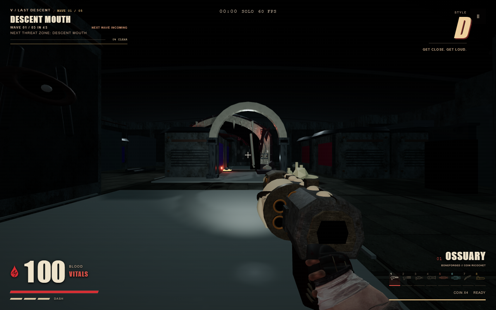
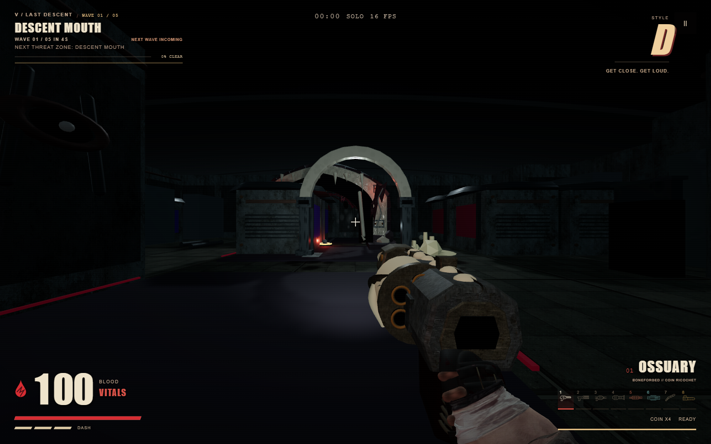

# Story map iteration — 23 September 2026

The five shaped Story floors now compile and play through their authored keys and exits. This pass repaired three route faults exposed by the tighter footprints:

- Floor 2's theater vent now meets a walkable part of the octagonal theater wall, restoring the hidden Morgue Drawer.
- Floor 3's Bone Vault and Skull Niche branch from the court before its key gate. The Reliquary Key can be reached without crossing the gate it unlocks.
- Floors 2 and 5 have wider intake bays so both opening-wave enemies can spawn outside the player's three-cell clearance.

The final descent's route plates and red seams keep their authored material instead of inheriting the generic afterlife floor treatment. The entry lantern no longer turns the foreground plate into a white rectangle.

An independent visual judge scored a proposed five-floor crown kit 1/3: it clipped or obscured the focal view on several floors. The kit was reverted; its captures are retained as a rejected experiment. The floor-material correction adds no draw calls or geometry.

Validation: 18 map, art, and surface tests passed; the production build succeeded; a final floor 5 browser capture reported no page or HTTP errors. The all-floor browser capture before the final material correction also reported no errors.
