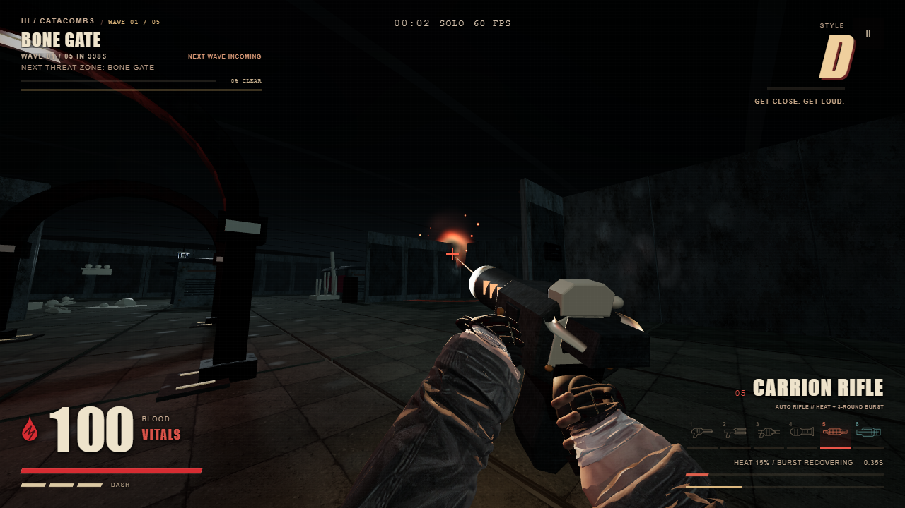
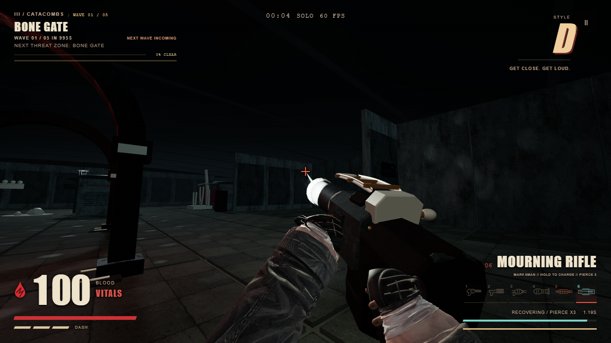

# Rifle pass

Two new weapons extend the existing arsenal without changing map layouts or requiring ammunition pickups.

| Slot | Weapon | Primary | Alternate |
| --- | --- | --- | --- |
| 5 | Carrion | Hold for automatic fire; heat gradually widens spread | Three precise rounds, then a short recovery |
| 6 | Mourning | Heavy single shot | Hold for 0.55 seconds to fire through up to three enemies; early release cancels |

The weapons share the game's worn metal, wood, and brass material language, with distinct silhouettes, animated bolts, tailored recoil, heat/charge feedback, and separate sampled reports. The existing six-slot selector, number keys, wheel, and touch weapon cycle all reach both rifles. Charge state and queued bursts reset when switching away.

Damage remains host-authoritative. Local guest prediction drives presentation only. Charged rounds stop at walls and floors, have a three-target limit, and lose damage through successive targets. Enemy headshot and close-range healing rules still apply.

## Lightweight verification

- `node --test engine.test.mjs tests/rifle-combat.test.mjs tests/rifle-model.test.mjs tests/weapon-batching.test.mjs tests/weapon-mechanism-motion.test.mjs`: 37 passing checks after the visual correction.
- First source browser pass: all six slots switched and fired, held automatic input fired repeatedly, a tap completed exactly three burst rounds, early release cancelled charge, full charge fired, and the 390-pixel HUD fit. No page, console, or HTTP errors.
- Screenshot review caught dark body materials and an overly broad rear silhouette. Corrected material value separation, diffuse fill, receiver/stock proportions, hand fit, and rifle pose before the final production capture.
- Final production build and browser pass passed: all six slots, automatic fire, exact three-round burst, charge cancellation/full charge, both narrow rifle HUDs, and distinct decoded rifle reports/mechanism/charge cues. No page, console, or HTTP errors. Production capture uses the corrected materials and pose.
- Model budgets: Carrion 5,096 triangles; Mourning 4,164 triangles before static batching. Both preserve named moving mechanisms and muzzle sockets at their actual barrel tips.

`qa-results.json` and the adjacent images record the first source pass; `production/` records the final packaged pass. Render-call snapshots are diagnostics, not a frame-rate benchmark. The focused engine tests cover peer authority; this pass does not claim a fresh two-browser internet co-op certification.

Asset decisions and provenance: [model/material notes](../rifle-design.md), [audio sources and processing](../rifle-audio.md). Runtime needs only bundled assets. No remote generation or runtime service was added.

## Final captures

